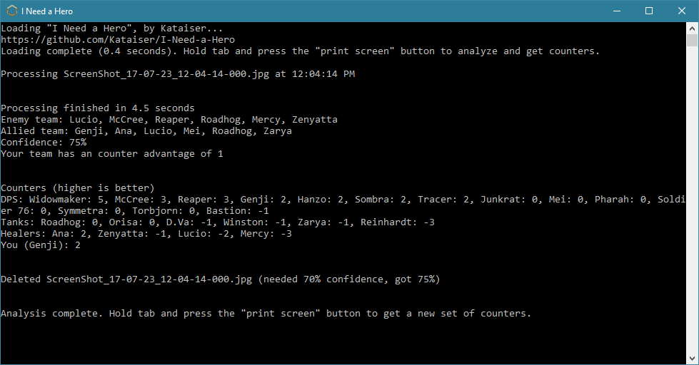

# I-Need-a-Hero
Uses image recognition, based on an automatically loaded screenshot, to suggest the best (and worst) heroes for you and your team to play.

**Features:**
- Once it's running, it's almost entirely automatic (no manually entering heroes)
- Processes fairly quickly (4ish seconds for me)
- Auto deletes tab menu screenshots (see note at bottom of readme)
- Shows confidence of image recognition, per hero and overall
- Shows which team currently has the counter advantage
- Sorts by hero type (DPS, tank, and healer)
- Comprehensive settings file

**Download:** https://github.com/Kataiser/I-Need-a-Hero/releases

**Installation and running instructions:**
Unzip to \Documents\Overwatch\ScreenShots (but not to \Documents\Overwatch\ScreenShots\Overwatch) and launch setup.bat (double click). To run, launch run.bat, move the windows to a second monitor (if you have one), then hold tab and press the "print screen" button once in game. Only works properly once the enemies are actually displayed.

**Requirements:** Python 3.6 or newer (https://www.python.org/downloads). Libraries are downloaded by setup.bat.

**NOTE:** it auto deletes screenshots it deems to be of the tab menu, so keep that in mind. If this bothers you, change "delete_thresehold" in settings.ini to 100. 

**Trello board:** https://trello.com/b/7pb5hLHX

*All character portraits used are property of Blizzard Entertainment Inc. This program is not associated with nor endorsed by Blizzard Entertainment.*
