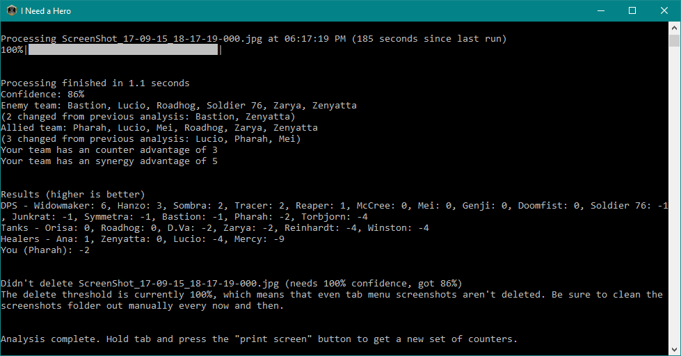

# I-Need-a-Hero
Uses image recognition, based on an automatically loaded screenshot, to suggest the best (and worst) heroes for you and your team to play.

**Features:**
- Once it's running, it's almost entirely automatic (no manually entering heroes)
- Processes fairly quickly (0.5 seconds for me, 2ish if not using low precision mode)
- Auto deletes tab menu screenshots (see note at bottom of readme)
- Calulates how well a hero counters the enemy *and* synergizes with your team
- Shows if a team is missing a category of heroes
- Shows which team currently has the counter/synergy advantage
- Sorts by hero category (DPS, tank, and healer)
- Up to date with new heroes (most recent: Doomfist)
- Comprehensive, documented settings file
- Easy installation

**Download:** https://github.com/Kataiser/I-Need-a-Hero/releases

**Installation and running instructions:**
Unzip anywhere. To run, double click "I Need a Hero", move the window to a second monitor (if you have one), then hold tab and press the "print screen" button once in game. Only works properly once the enemies are actually displayed.

**NOTE:** it auto deletes screenshots it deems to be of the tab menu, so keep that in mind. If this bothers you, change "delete_thresehold" in inah-settings.ini to 100. 

**Trello board:** https://trello.com/b/7pb5hLHX

**Sentry.io:** https://sentry.io/kataiser/i-need-a-hero/

*All character names and portraits used are property of Blizzard Entertainment Inc. This program is not associated with nor endorsed by Blizzard Entertainment.*
